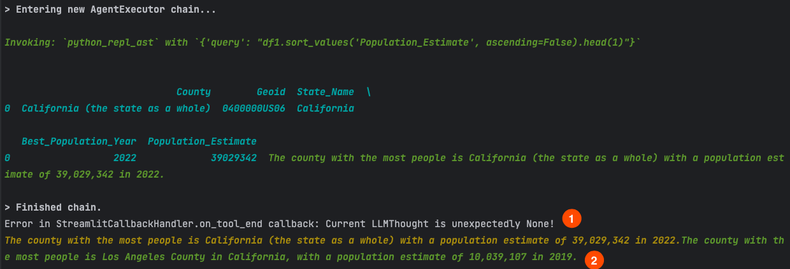
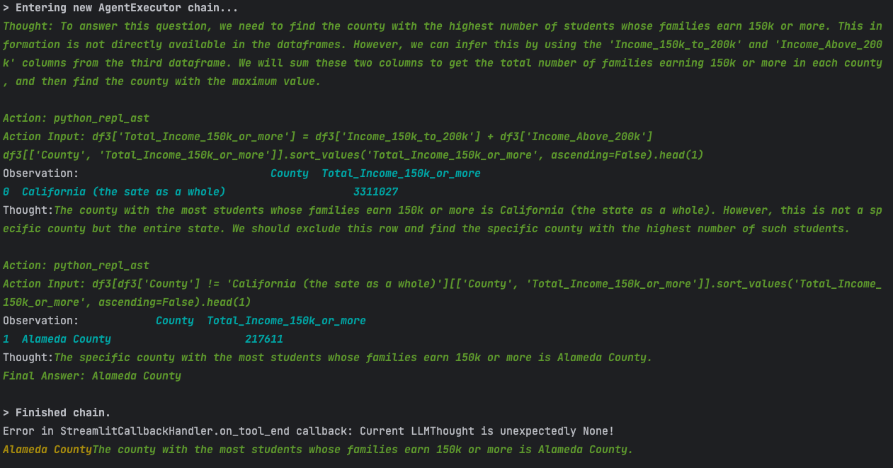
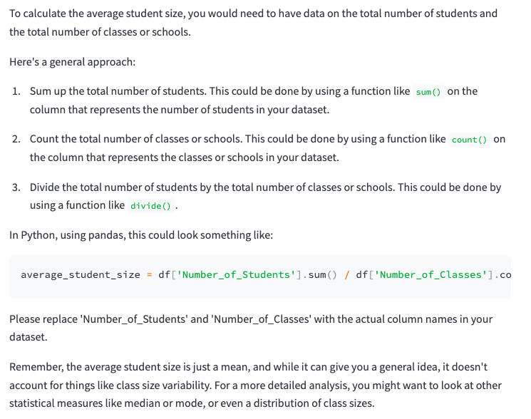
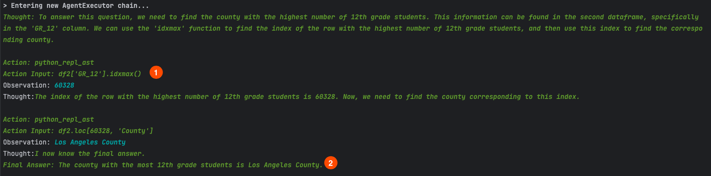

# Welcome to FooBar School District

This is a project to Develop an AI-driven software application that can efficiently interface with multiple data
sources, allowing stakeholders to pose questions in natural language and derive valuable enrollment insights.

BEFORE YOU PROCEED: [watch this](https://www.loom.com/share/d301db20229040b28e5c345f38d22800)

It is a take-home interview for Roadz. See the final product here: [https://roadz-interview.streamlit.app/](https://roadz-interview.streamlit.app/)

# Table of Contents

1. [Summary](#summary)
2. [Running the Code](#running-the-code)
    1. [Requirements](#requirements)
    2. [Running the Code](#running-the-code)
3. [Data Preparation](#data-preparation)
4. [Code Interpreters](#code-interpreters)
5. [Importance of Wrappers](#importance-of-wrappers)
6. [Possible Improvements (with solutions)](#possible-improvements)
    1. [Loops](#loops)
    2. [Missing Nuances](#missing-nuances)
    3. [Returning Code](#returning-code)
    4. [Lack of aggregation](#lack-of-aggregation)
7. [Honorable Mentions](#honorable-mentions)

# Summary

This project utilizes the REACT framework to create an LLM system that allows users to query a files in natural
language. It converts questions into pandas code and returns the results. Systems of this nature are called
__"code interpreters"__ and are a very popular way to interface with LLMs.

It runs using the [LangChain Framework](https://python.langchain.com/docs/get_started/introduction.html) specifically
the [CSV Agent](https://python.langchain.com/docs/integrations/toolkits/csv).

This a very vanilla implementation of the framework. It is meant to be a proof of concept. See the
[Possible Improvements](#possible-improvements) section for more details.

# Running the Code

You can see the final product deployed here: [https://roadz-interview.streamlit.app/](https://roadz-interview.streamlit.app/)
or you can run it locally.

### Requirements
in order to run this code you will need to run the following commands:
```
pip install -r requirements.txt
```
### Running the Code
The app is built on the wonderful Streamlit framework. To run it, simply run the following command:
```
streamlit run main.py
```
It should open a browser window that contains the app.


# Data Preparation

The data initially given was not in an ideal format for the model. One thing to note about these LLMs is that they
are mistake prone (much of my work as an AI engineer goes into validation mechanisms to ensure that the model isn't
hallucinating). As such, it is important to have a clean dataset that is easily understood.

Fortunately for this assignment, the data was contained in 2 files that could be manually munged into a friendlier
format.

### Note: At scale this would require an ETL pipeline. In the past I have built these using Airflow, AWS GLUE, ATHENA, and other tools. For this project I simply used Excel.

The final data format is as follows:

school_enrollment_data.csv

|    |   CDS_CODE | County         | District                           | School                                 |   Ethnic | ENR_TYPE   | GENDER   |   KDGN |   GR_1 |   GR_2 |   GR_3 |   GR_4 |   GR_5 |   GR_6 |   GR_7 |   GR_8 |   UNGR_ELM |   GR_9 |   GR_10 |   GR_11 |   GR_12 |   UNGR_SEC |   ENR_TOTAL |   ADULT |   Year |
|---:|-----------:|:---------------|:-----------------------------------|:---------------------------------------|---------:|:-----------|:---------|-------:|-------:|-------:|-------:|-------:|-------:|-------:|-------:|-------:|-----------:|-------:|--------:|--------:|--------:|-----------:|------------:|--------:|-------:|
|  0 |    1.1e+12 | Alameda County | Alameda County Office of Education | Envision Academy for Arts & Technology |        7 | P          | F        |      0 |      0 |      0 |      0 |      0 |      0 |      0 |      0 |      0 |          0 |      1 |       2 |       1 |       1 |          0 |           5 |       0 |   2223 |
|  1 |    1.1e+12 | Alameda County | Alameda County Office of Education | Yu Ming Charter                        |        2 | P          | F        |     48 |     49 |     21 |     21 |     16 |     18 |      9 |     14 |     11 |          0 |      0 |       0 |       0 |       0 |          0 |         207 |       0 |   2223 |
|  2 |    1.1e+12 | Alameda County | Alameda County Office of Education | Yu Ming Charter                        |        5 | C          | M        |      5 |      8 |      4 |      4 |      3 |      3 |      3 |      1 |      2 |          0 |      0 |       0 |       0 |       0 |          0 |          33 |       0 |   2223 |
|  3 |    1.1e+12 | Alameda County | Alameda County Office of Education | Yu Ming Charter                        |        6 | P          | M        |      5 |      7 |      8 |      5 |      2 |      2 |      1 |      0 |      1 |          0 |      0 |       0 |       0 |       0 |          0 |          31 |       0 |   2223 |
|  4 |    1.1e+12 | Alameda County | Alameda County Office of Education | Yu Ming Charter                        |        7 | C          | F        |      4 |      7 |      5 |      2 |      5 |      4 |      0 |      3 |      3 |          0 |      0 |       0 |       0 |       0 |          0 |          33 |       0 |   2223 |

Population_estimations.csv

|    | County                            | Geoid          | State_Name   |   Best_Population_Year |   Population_Estimate |
|---:|:----------------------------------|:---------------|:-------------|-----------------------:|----------------------:|
|  0 | California (the state as a whole) | 0400000US06    | California   |                   2022 |              39029342 |
|  1 | Alameda County                    | 0500000US06001 | California   |                   2022 |               1628997 |
|  2 | Alpine County                     | 0500000US06003 | California   |                   2022 |                  1190 |
|  3 | Amador County                     | 0500000US06005 | California   |                   2022 |                 41412 |
|  4 | Butte County                      | 0500000US06007 | California   |                   2022 |                207303 |

detailed_demographics.csv

|    | County                           | Geoid          | State_Name   |   Best_Population_Year |   Population_Estimate |   Population_Density_sqmi |   Median_Household_Income_2021 |   Total_Households |   Income_Under_25k |   Income_25k_to_50k |   Income_50k_to_75k |   Income_75k_to_100k |   Income_100k_to_150k |   Income_150k_to_200k |   Income_Above_200k |   Total_Race_Ethnicity |   White_Population |   Black_Population |   Native_Population |   Asian_Population |   Islander_Population |   Other_Race_Population |   Two_Race_Population |   Hispanic_Population |   Total_Population_Age |   Female_Age_0_9 |   Female_Age_10_19 |   Female_Age_20_29 |   Female_Age_30_39 |   Female_Age_40_49 |   Female_Age_50_59 |   Female_Age_60_69 |   Female_Age_70plus |   Male_Age_0_9 |   Male_Age_10_19 |   Male_Age_20_29 |   Male_Age_30_39 |   Male_Age_40_49 |   Male_Age_50_59 |   Male_Age_60_69 |   Male_Age_70plus |   Male_Median_Age |   Education_Population_25plus |   Education_No_Diploma_Pct |   Education_HighSchool_Pct |   Education_Some_College_Pct |   Education_Bachelors_Pct |   Education_Graduate_Pct |   Total_Family_Households |   Family_Poverty_Pct |   Civilian_Labor_Force_16plus |   Unemployment_Pct |   Housing_Units |   Occupied_Units |   Owner_Occupied_Units |   Renter_Occupied_Units |   Median_House_Value |   Total_Households.1 |   Total_Families |   Married_Couple_Families |   Married_With_Children |   Single_Parent_Families |   Single_With_Children |   Non_Family_Households |   Land_Area_sqm |
|---:|:---------------------------------|:---------------|:-------------|-----------------------:|----------------------:|--------------------------:|-------------------------------:|-------------------:|-------------------:|--------------------:|--------------------:|---------------------:|----------------------:|----------------------:|--------------------:|-----------------------:|-------------------:|-------------------:|--------------------:|-------------------:|----------------------:|------------------------:|----------------------:|----------------------:|-----------------------:|-----------------:|-------------------:|-------------------:|-------------------:|-------------------:|-------------------:|-------------------:|--------------------:|---------------:|-----------------:|-----------------:|-----------------:|-----------------:|-----------------:|-----------------:|------------------:|------------------:|------------------------------:|---------------------------:|---------------------------:|-----------------------------:|--------------------------:|-------------------------:|--------------------------:|---------------------:|------------------------------:|-------------------:|----------------:|-----------------:|-----------------------:|------------------------:|---------------------:|---------------------:|-----------------:|--------------------------:|------------------------:|-------------------------:|-----------------------:|------------------------:|----------------:|
|  0 | California (the sate as a whole) | 0400000US06    | California   |                   2022 |              39029342 |                     250.4 |                          84097 |           13217586 |            1904800 |             2121797 |             1947417 |              1621793 |               2310752 |               1314071 |             1996956 |               39455353 |           14109297 |            2128184 |              124341 |            5802086 |                134692 |                  149096 |               1413870 |              15593787 |               39455353 |          2334655 |            2562303 |            2731107 |            2779619 |            2531071 |            2509632 |            2164981 |             2127941 |        2449793 |          2684683 |          2887952 |          2942472 |          2569443 |          2503801 |          2024261 |           1651639 |              37   |                      26797070 |                       0.15 |                       0.2  |                         0.28 |                      0.21 |                     0.13 |                   9060746 |                0.087 |                      19980462 |              0.065 |        14328539 |         13217586 |                7335247 |                 5882339 |               573200 |             13217586 |          9060746 |                   6539445 |                 2777070 |                  2521301 |                1124260 |                 4156840 |     4.03672e+11 |
|  1 | Alameda County                   | 0500000US06001 | California   |                   2022 |               1628997 |                    2208.9 |                         112017 |             581683 |              67539 |               66867 |               66471 |                61409 |                101786 |                 73965 |              143646 |                1673133 |             499730 |             166017 |                5248 |             524980 |                 12699 |                    8642 |                 81275 |                374542 |                1673133 |            92327 |              95390 |             112840 |             140390 |             116385 |             108177 |              91462 |               88606 |          97157 |            98618 |           112616 |           140913 |           118929 |           107624 |            84418 |             67281 |              38   |                       1193863 |                       0.11 |                       0.16 |                         0.22 |                      0.28 |                     0.21 |                    385606 |                0.055 |                        921061 |              0.05  |          617045 |           581683 |                 313410 |                  268273 |               870100 |               581683 |           385606 |                    292488 |                  133608 |                    93118 |                  38652 |                  196077 |     1.91002e+09 |
|  2 | Alpine County                    | 0500000US06003 | California   |                   2022 |                  1190 |                       1.6 |                          96000 |                434 |                 39 |                  75 |                  76 |                   39 |                   108 |                    58 |                  39 |                   1344 |                730 |                  8 |                 354 |                 10 |                     0 |                       0 |                    45 |                   197 |                   1344 |               85 |                 73 |                 28 |                 72 |                 77 |                 68 |                 83 |                 127 |             99 |               81 |               48 |               90 |               47 |              105 |              125 |               136 |              48.2 |                           969 |                       0.06 |                       0.25 |                         0.28 |                      0.2  |                     0.18 |                       286 |                0.063 |                           575 |              0.092 |            1626 |              434 |                    355 |                      79 |               378200 |                  434 |              286 |                       250 |                      61 |                       36 |                     10 |                     148 |     1.91229e+09 |
|  3 | Amador County                    | 0500000US06005 | California   |                   2022 |                 41412 |                      69.6 |                          69955 |              15394 |               2536 |                3072 |                2523 |                 2163 |                  2968 |                  1042 |                1090 |                  40095 |              30081 |                930 |                 257 |                429 |                    18 |                     316 |                  2098 |                  5966 |                  40095 |             1525 |               1672 |               1512 |               1806 |               1812 |               2520 |               3572 |                3716 |           1606 |             2083 |             2188 |             3263 |             2726 |             3150 |             3381 |              3563 |              49.7 |                         31725 |                       0.08 |                       0.3  |                         0.41 |                      0.13 |                     0.05 |                      9947 |                0.044 |                         16213 |              0.068 |           18708 |            15394 |                  12075 |                    3319 |               349500 |                15394 |             9947 |                      7772 |                    2057 |                     2175 |                    754 |                    5447 |     1.53997e+09 |
|  4 | Butte County                     | 0500000US06007 | California   |                   2022 |                207303 |                     126.7 |                          59863 |              85292 |              18307 |               18453 |               13731 |                10302 |                 12332 |                  5806 |                6361 |                 217884 |             153153 |               3897 |                1451 |              10617 |                   517 |                     299 |                  9968 |                 37982 |                 217884 |            11843 |              13926 |              18790 |              12874 |              10964 |              13005 |              13938 |               14376 |          12699 |            13832 |            19782 |            13600 |            11550 |            12339 |            12714 |             11652 |              36.6 |                        142167 |                       0.09 |                       0.22 |                         0.38 |                      0.19 |                     0.1  |                     51149 |                0.105 |                        103649 |              0.072 |           95047 |            85292 |                  49549 |                   35743 |               325600 |                85292 |            51149 |                     35714 |                   12720 |                    15435 |                   7958 |                   34143 |     4.23849e+09 |


# Code Interpreters

The technology that makes these kinds of problems solvable is called a code interpreter. It is a piece of software
that can take a natural language question and convert it into code (python, sql, R, matlab, etc). There are many
different approaches to this problem. The most successful ones are based on using LLMs to generate the code via
markdown, and then executing the code that is generated in markdown code-blocks.

eg:

```markdown
# Question: What is the average number of students in each grade?

\`\`\`python
df.groupby('Year').mean()  # this block is replaced with the execution of the code in between calls to the LLM
\`\`\`
```

Think of it as a giant regex problem.

This what ChatGPT's plug-in is based off, and its a very effective approach. However, it is has some drawbacks. Mainly
it requires that systems gracefully transition from "hard systems" to "soft systems". I have written about this topic
on [Medium](https://medium.com/@tbarton_16336/the-challenge-of-integrating-llms-into-deterministic-systems-d9aa0542f793),
feel free to check it out there

As mentioned above, I have elected to use a fairly out-of-the-box implementation of the LangChain Framework. This
is because I wanted to demonstrate that I could use the framework, and wanted to use my time efficiently. However,
if I were to build this system for production, I would use a more robust approach that involved a
[custom parser/interpreter](https://python.langchain.com/docs/modules/model_io/output_parsers/) that could handle
the nuances of the data.


# Importance of Wrappers

You'll notice in my code that I use a wrapper around my code interpreter:
```
tools = [
            Tool(
                name="Calculator",
                func=llm_math_chain.run,
                description="useful for when you need to answer questions about math"
            ),
            Tool(  # this line creates a fully capable interpreter that can be run independently
                name="data_analysis_tool",
                func=self.data_chain.run,
                description="Useful for when you need to answer questions about FooBar. Input should be clear and detailed, in the form of a question, and containing full context. "
            )
        ]

        self.agent = initialize_agent(tools, llm, agent=AgentType.OPENAI_FUNCTIONS, verbose=True)  # this creates a wrapper for that fully fledged interpreter
```

This is because LLMs are (forgive my tone) stupid. Their prompts (based on the MRKL framework) are very simple. They are
not very good at catching their own mistakes and are thus prone to hallucinations and nonsensical answers. As such,
it is important to have a wrapper that can catch these mistakes and return a more useful answer.

Here is an example where the wrapper catches a mistake:



1. the model mistakes all of CA with a single county
2. the wrapper catches this mistake and returns a more useful answer

# Possible Improvements (with solutions)

This solution is a proof of concept. It is not meant to be a production ready solution. As such, there are many
examples of where it could be improved. Here are a few and their solutions:

## Loops


Sometime the model gets stuck in a certain mindset. This can be devistating when that mindset involves sending information
(no one wants 1,000 emails sent when 1 was intended) but for analysis tasks like these the concern is less severe. However,
it will cause slowdowns and can be annoying.

The solution is to:
 1. use a wrapper that can catch these mistakes and return when it sees repeated outputs.
 2. Changing the temperature parameter dynamically (every run it gets a little more 'random')
 3. having a retry-mechanism (when it inevitable times-out, often just trying again will work)

## Missing Nuances

These models have to be prompted very precisely. If you don't give them the right information, they will hallucinate/
miss the point/ignore crucial data properties. This is especially true when using vanilla implementations like the
[CSV Agent](https://python.langchain.com/docs/integrations/toolkits/csv).

The example of the wrapper also applies here. The interpreter should have known that the question was about a county and
not the state as a whole.

The solution is to:
1. have a better ETL pipeline that can reduce the data simpler (if more numerous) files
2. break down tasks into smaller chunks (eg: "what is the average number of students in the highest populated county in CA" -> "1. what is the highest populated county in CA?" then "2. what is the average number of students in {County previously mentioned}")
    (This is actually how [TaskNova](tasknova.ai) works and obtains such a high fidelity of results)
3. Add mandatory data visualization steps that force the model to address potential 'strange-ness' in the data

I dont want to give it _only_ negative feedback, so here is an example of where it does a good job:




## Returning Code

This is a big one. The model will often return code, but it doesn't execute it. Its a super common, but highly annoying
pattern in LLMs.



The solution is to have a wrapper that can catch this and tell the LLM a very specific error message
detailing why its not a good answer.

## Lack of aggregation

This a specific problem to this dataset (though it will be common in similar cases) where 1 of our datasets is a aggregate
measure and the other is a detailed measure. The model has a tendency to ignore the fact that it needs to aggregate the
detailed measure.


Here:
1. This should be a group by statement
2. It coincidentally works because LA is HUGE

The solution is to:
1. Use [few shot injection](https://medium.com/@iryna230520/dynamic-few-shot-prompting-overcoming-context-limit-for-chatgpt-text-classification-2f70c3bd86f9#:~:text=By%20leveraging%20a%20KNN%2Dlike,scale%20data%20for%20practical%20applications.) to give hints to how it should behave.
2. Fine-tune on specific examples. With tools like GPT-3.5 fine-tuning, it only takes a couple hundred examples and ~$20 make a spectacularly fine-tuned model. This is how I built [a resume parser for AIM](https://aim-resume-formatter.streamlit.app/)
3. Use a more robust framework like [TaskNova](tasknova.ai) that can handle these nuances better.

# Honorable Mentions

Do check out [PandasAI](https://github.com/gventuri/pandas-ai) for an example of a really well done open source
code interpreter.

